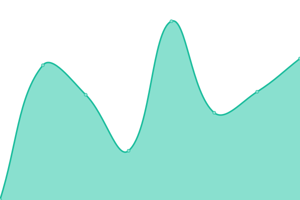

# [📈 Live Status](https://annis971027.github.io/upptime): <!--live status--> **🟧 Partial outage**

This repository contains the open-source uptime monitor and status page for [annis971027](https://annis971027.github.io/upptime), powered by [Upptime](https://github.com/upptime/upptime).

With [Upptime](https://upptime.js.org), you can get your own unlimited and free uptime monitor and status page, powered entirely by a GitHub repository. We use [Issues](https://github.com/annis971027/upptime/issues) as incident reports, [Actions](https://github.com/annis971027/upptime/actions) as uptime monitors, and [Pages](https://annis971027.github.io/upptime) for the status page.

<!--start: status pages-->
<!-- This summary is generated by Upptime (https://github.com/upptime/upptime) -->
<!-- Do not edit this manually, your changes will be overwritten -->
<!-- prettier-ignore -->
| URL | Status | History | Response Time | Uptime |
| --- | ------ | ------- | ------------- | ------ |
|  [YouTube](https://www.youtube.com/) | 🟩 Up | [you-tube.yml](https://github.com/annis971027/upptime/commits/HEAD/history/you-tube.yml) | 

 256ms
     
 | 

<a href="https://annis971027.github.io/upptime/history/you-tube">100.00%</a>
    

|  [NCU Portal](https://portal.ncu.edu.tw/login) | 🟩 Up | [ncu-portal.yml](https://github.com/annis971027/upptime/commits/HEAD/history/ncu-portal.yml) | 

 1917ms
     
 | 

<a href="https://annis971027.github.io/upptime/history/ncu-portal">100.00%</a>
    

|  [new EE-class](https://ncueeclass.ncu.edu.tw/) | 🟩 Up | [new-ee-class.yml](https://github.com/annis971027/upptime/commits/HEAD/history/new-ee-class.yml) | 

 2455ms
     
 | 

<a href="https://annis971027.github.io/upptime/history/new-ee-class">100.00%</a>
    

|  [Facebook](https://www.facebook.com/) | 🟩 Up | [facebook.yml](https://github.com/annis971027/upptime/commits/HEAD/history/facebook.yml) | 

 410ms
     
 | 

<a href="https://annis971027.github.io/upptime/history/facebook">100.00%</a>
    

|  [V Live](https://www.vlive.tv/home/chart?sub=VIDEO&period=HOUR_24&country=ALL) | 🟩 Up | [v-live.yml](https://github.com/annis971027/upptime/commits/HEAD/history/v-live.yml) | 

 1458ms
     
 | 

<a href="https://annis971027.github.io/upptime/history/v-live">100.00%</a>
    

|  [google-invalid](https://google.com.abc/123) | 🟥 Down | [google-invalid.yml](https://github.com/annis971027/upptime/commits/HEAD/history/google-invalid.yml) | 

 0ms
     
 | 

<a href="https://annis971027.github.io/upptime/history/google-invalid">100.00%</a>
    

<!--end: status pages-->

[**Visit our status website →**](https://annis971027.github.io/upptime)

## 📄 License

- Powered by: [Upptime](https://github.com/upptime/upptime)
- Code: [MIT](./LICENSE) © [annis971027](https://annis971027.github.io/upptime)
- Data in the `./history` directory: [Open Database License](https://opendatacommons.org/licenses/odbl/1-0/)
